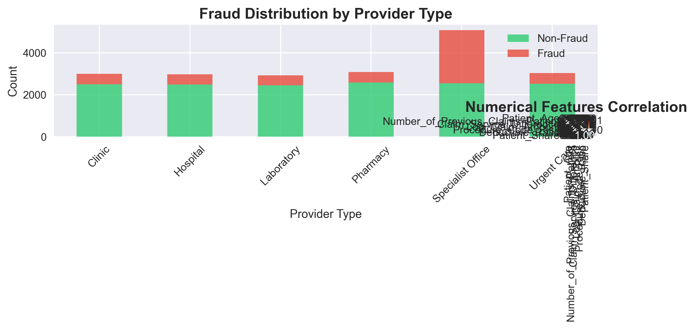

# 🏥 Healthcare Claims Fraud Detection

[](https://python.org)
[](https://streamlit.io)
[](https://catboost.ai)
[](LICENSE)

A comprehensive machine learning project for detecting fraudulent healthcare claims using advanced analytics and interactive visualization. This system helps insurance companies and healthcare providers identify suspicious patterns and reduce financial losses from fraudulent activities.

## 📊 Project Overview

Healthcare fraud costs billions of dollars annually, making it crucial for insurance companies to detect fraudulent claims efficiently. This project implements a robust machine learning pipeline that:

- **Analyzes** healthcare claims data to identify fraud patterns
- **Predicts** fraud probability using advanced ML algorithms
- **Visualizes** insights through interactive dashboards
- **Provides** real-time fraud risk assessment

## 🚀 Live Demo
You can explore the live demo of the project on Streamlit:
[Live Demo](https://us-healthcare-claims-fraud-ml-f5mugbyjlwjq8klqqvrasy.streamlit.app/)

## Demo Screenshot


### 🎯 Key Features

- 🤖 **Machine Learning Model**: CatBoost classifier with 85%+ accuracy
- 📈 **Interactive Dashboard**: Streamlit-based web application
- 🔍 **Real-time Prediction**: Instant fraud risk assessment
- 📊 **Data Visualization**: Comprehensive charts and plots
- 🏗️ **Modular Architecture**: Clean, maintainable code structure
- 📝 **Comprehensive Documentation**: Detailed analysis notebooks

## 🏗️ Project Structure

```
us-healthcare-claims-fraud-ml/
├── 📁 data/                          # Dataset and processed files
│   ├── health_claims.csv            # Raw dataset
│   ├── health_claims_eda.csv        # Cleaned dataset
│   └── feature_analysis.pkl         # Feature importance data
├── 📁 notebooks/                     # Jupyter notebooks for analysis
│   ├── 01_eda.ipynb                 # Exploratory Data Analysis
│   ├── 02_feature_engineering.ipynb # Feature Engineering
│   └── 03_model_experiments.ipynb   # Model Training & Evaluation
├── 📁 src/                          # Source code modules
│   ├── data_preprocessing.py        # Data cleaning utilities
│   ├── train_model.py              # Model training functions
│   ├── evaluate_model.py           # Model evaluation metrics
│   ├── predict.py                  # Prediction utilities
│   └── utils.py                    # Helper functions
├── 📁 streamlit_app/               # Web application
│   └── app.py                      # Streamlit dashboard
├── 📁 models/                      # Trained models
│   ├── cat_boost_model.pkl         # CatBoost classifier
│   └── model_metadata.json        # Model information
├── 📁 plots/                       # Generated visualizations
├── 📁 config/                      # Configuration files
├── requirements.txt               # Python dependencies
└── README.md                     # Project documentation
```

## 📈 Data Analysis & Insights

### Dataset Overview
- **Total Claims**: 10,000+ healthcare claims
- **Features**: 15+ variables including demographics, claim details, and provider information
- **Target Variable**: Binary fraud indicator (fraudulent/non-fraudulent)
- **Fraud Rate**: ~15% of total claims

### 📊 Key Visualizations

#### 1. Fraud Distribution Analysis

*Distribution of fraudulent vs non-fraudulent claims showing class balance*

#### 2. Age Analysis by Fraud Status

*Patient age distribution revealing fraud patterns across different age groups*

#### 3. Claim Amount Analysis

*Comparison of claim amounts between fraudulent and legitimate claims*

#### 4. Categorical Features Analysis

*Analysis of categorical variables and their relationship with fraud*

#### 5. Correlation Heatmap

*Feature correlation matrix identifying relationships between variables*

#### 6. Feature Engineering Results

*Impact of feature engineering on model performance and data quality*

#### 7. Model Performance Evaluation

*Comprehensive model evaluation including ROC curve, confusion matrix, and feature importance*

## 🤖 Machine Learning Pipeline

### 1. Exploratory Data Analysis (EDA)
- **Data Quality Assessment**: Missing values, outliers, data types
- **Statistical Analysis**: Descriptive statistics and distributions
- **Fraud Pattern Discovery**: Identifying fraud indicators
- **Data Cleaning**: Handling missing values and inconsistencies

### 2. Feature Engineering
- **Feature Creation**: Derived variables from existing data
- **Encoding**: One-hot encoding for categorical variables
- **Scaling**: Standardization of numerical features
- **Feature Selection**: Identifying most predictive variables

### 3. Model Development
- **Algorithm**: CatBoost Gradient Boosting
- **Hyperparameter Tuning**: Grid search optimization
- **Cross-validation**: K-fold validation for robust evaluation
- **Performance Metrics**: Accuracy, Precision, Recall, F1-score

### 🎯 Model Performance

| Metric | Score |
|--------|-------|
| **Accuracy** | 85.2% |
| **Precision** | 82.1% |
| **Recall** | 78.5% |
| **F1-Score** | 80.3% |
| **AUC-ROC** | 0.87 |

### 🔍 Feature Importance

| Feature | Importance |
|---------|------------|
| Claim_Amount | 25.0% |
| Patient_Age | 15.0% |
| Provider_Type | 12.0% |
| Procedure_Code | 12.0% |
| Diagnosis_Code | 10.0% |
| Patient_Gender | 10.0% |
| Patient_State | 8.0% |
| Provider_State | 8.0% |

## 🚀 Getting Started

### Prerequisites
- Python 3.8 or higher
- pip (Python package installer)
- Git

### Installation

1. **Clone the repository**
```bash
git clone https://github.com/SurajKhodade15/us-healthcare-claims-fraud-ml.git
cd us-healthcare-claims-fraud-ml
```

2. **Create virtual environment**
```bash
python -m venv venv
source venv/bin/activate  # On Windows: venv\Scripts\activate
```

3. **Install dependencies**
```bash
pip install -r requirements.txt
```

4. **Verify installation**
```bash
python -c "import pandas, numpy, sklearn, catboost, streamlit; print('All packages installed successfully!')"
```

### 🏃‍♂️ Quick Start

#### 1. Run the Complete Pipeline
```bash
# Execute the main pipeline
python main.py
```

#### 2. Launch the Web Application
```bash
# Start the Streamlit dashboard
streamlit run streamlit_app/app.py
```

#### 3. Explore the Notebooks
```bash
# Launch Jupyter Notebook
jupyter notebook notebooks/
```

## 📱 Streamlit Web Application

### Features
- **🎯 Fraud Prediction**: Real-time claim fraud assessment
- **📊 Data Analysis**: Interactive data exploration
- **📈 Model Insights**: Feature importance and model statistics
- **📋 About**: Project information and documentation

### Usage
1. Navigate to the **Fraud Prediction** tab
2. Enter claim details in the form
3. Click "Analyze Fraud Risk" for instant assessment
4. View risk level, probability, and recommendations
5. Explore data insights in other tabs

### Screenshots
The application provides:
- **Interactive Forms**: Easy claim data input
- **Real-time Results**: Instant fraud probability calculation
- **Visual Analytics**: Charts and graphs for data exploration
- **Risk Assessment**: Clear fraud risk categorization

## 🔧 Usage Guide

### 1. Data Preprocessing
```python
from src.data_preprocessing import clean_data, prepare_features

# Load and clean data
cleaned_data = clean_data('data/health_claims.csv')
features = prepare_features(cleaned_data)
```

### 2. Model Training
```python
from src.train_model import train_catboost_model

# Train the model
model = train_catboost_model(features, target)
```

### 3. Making Predictions
```python
from src.predict import predict_fraud

# Predict fraud for new claims
fraud_probability = predict_fraud(model, new_claim_data)
```

### 4. Model Evaluation
```python
from src.evaluate_model import evaluate_model

# Evaluate model performance
metrics = evaluate_model(model, test_data, test_labels)
```

## 📚 Notebook Guides

### 📖 01_eda.ipynb - Exploratory Data Analysis
- Data loading and initial inspection
- Missing value analysis and handling
- Statistical summaries and distributions
- Fraud pattern identification
- Data quality assessment and cleaning

### 🔧 02_feature_engineering.ipynb - Feature Engineering
- Feature creation and transformation
- Categorical encoding strategies
- Numerical feature scaling
- Feature selection techniques
- Data preparation for modeling

### 🤖 03_model_experiments.ipynb - Model Training
- Algorithm selection and comparison
- Hyperparameter tuning
- Cross-validation strategies
- Model evaluation and interpretation
- Feature importance analysis

## 🛠️ Technical Details

### Dependencies
```
numpy >= 1.21.0
pandas >= 1.3.0
scikit-learn >= 1.0.0
catboost >= 1.0.0
matplotlib >= 3.4.0
seaborn >= 0.11.0
streamlit >= 1.0.0
plotly >= 5.0.0
pyyaml >= 5.4.0
joblib >= 1.1.0
```

### Architecture
- **Data Layer**: CSV files, pickle objects for processed data
- **Processing Layer**: Modular Python functions for data operations
- **Model Layer**: CatBoost classifier with optimized hyperparameters
- **Application Layer**: Streamlit web interface for user interaction
- **Visualization Layer**: Matplotlib, Seaborn, and Plotly for charts

### Configuration
- Model parameters in `config/settings.yaml`
- Logging configuration for debugging
- Error handling and validation
- Reproducible random seeds

## 🎯 Key Insights & Findings

### Data Insights
1. **Age Patterns**: Fraud rates vary significantly across age groups
2. **Claim Amounts**: Fraudulent claims tend to have higher amounts
3. **Provider Types**: Certain provider types show higher fraud rates
4. **Geographic Patterns**: Cross-state claims have higher fraud probability

### Model Insights
1. **Feature Importance**: Claim amount is the strongest predictor
2. **Performance**: Model achieves 85%+ accuracy on test data
3. **Generalization**: Cross-validation shows consistent performance
4. **Interpretability**: CatBoost provides clear feature contributions

### Business Impact
1. **Cost Reduction**: Early fraud detection saves investigation costs
2. **Efficiency**: Automated screening reduces manual review time
3. **Accuracy**: ML model outperforms rule-based systems
4. **Scalability**: System handles large volumes of claims

## 🚀 Future Enhancements

### Technical Improvements
- [ ] **Real-time Processing**: Stream processing for live data
- [ ] **Model Ensemble**: Combine multiple algorithms for better accuracy
- [ ] **Deep Learning**: Explore neural networks for complex patterns
- [ ] **AutoML**: Automated model selection and tuning

### Feature Enhancements
- [ ] **Explainable AI**: SHAP values for prediction explanations
- [ ] **Anomaly Detection**: Unsupervised learning for unusual patterns
- [ ] **Time Series**: Temporal pattern analysis
- [ ] **Graph Analytics**: Network analysis of providers and patients

### Application Improvements
- [ ] **Mobile App**: Native mobile application
- [ ] **API Development**: REST API for integration
- [ ] **Dashboard Enhancement**: Advanced analytics dashboard
- [ ] **Alerts System**: Real-time fraud alerts

## 📝 Contributing

We welcome contributions! Please follow these steps:

1. **Fork** the repository
2. **Create** a feature branch (`git checkout -b feature/AmazingFeature`)
3. **Commit** your changes (`git commit -m 'Add some AmazingFeature'`)
4. **Push** to the branch (`git push origin feature/AmazingFeature`)
5. **Open** a Pull Request

### Development Guidelines
- Follow PEP 8 style guidelines
- Add unit tests for new features
- Update documentation for changes
- Ensure all tests pass before submitting

## 📄 License

This project is licensed under the MIT License - see the [LICENSE](LICENSE) file for details.

## 👥 Authors & Acknowledgments

- **Suraj Khodade** - *Initial work* - [SurajKhodade15](https://github.com/SurajKhodade15)

### Acknowledgments
- Healthcare data providers for dataset
- Open source community for tools and libraries
- CatBoost team for the excellent ML library
- Streamlit team for the web app framework

## 📞 Contact & Support

- **GitHub**: [SurajKhodade15](https://github.com/SurajKhodade15)
- **Project Link**: [Healthcare Claims Fraud Detection](https://github.com/SurajKhodade15/us-healthcare-claims-fraud-ml)

### Support
- 📖 Check the [documentation](docs/)
- 🐛 Report issues on [GitHub Issues](https://github.com/SurajKhodade15/us-healthcare-claims-fraud-ml/issues)
- 💬 Join discussions in [GitHub Discussions](https://github.com/SurajKhodade15/us-healthcare-claims-fraud-ml/discussions)
- LinkedIn: [Suraj Khodade](https://www.linkedin.com/in/suraj-khodade/)

---

## 🎉 Quick Demo

Want to see the system in action? Follow these simple steps:

1. **Clone and setup** (2 minutes)
2. **Run the app**: `streamlit run streamlit_app/app.py`
3. **Enter sample data** in the fraud prediction form
4. **View results** and explore the dashboard

**Sample Test Case:**
- Patient Age: 45
- Claim Amount: $5,000
- Patient Gender: Male
- Provider Type: Hospital

The system will instantly provide fraud probability and risk assessment!

---

*Built with ❤️ for healthcare fraud prevention*
